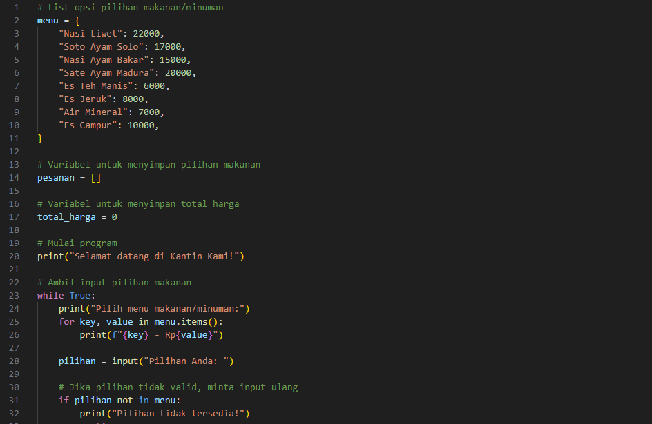
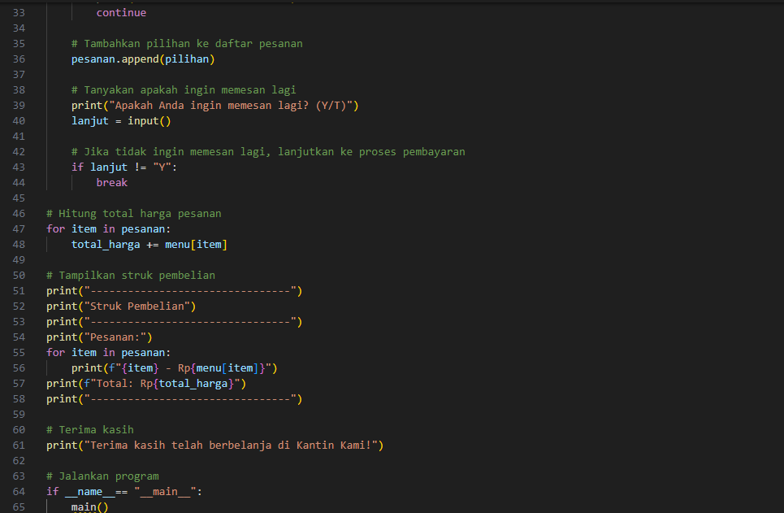
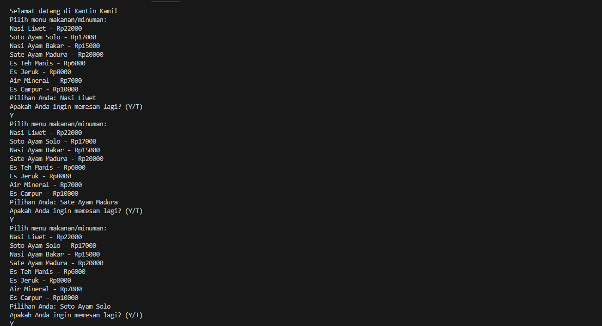
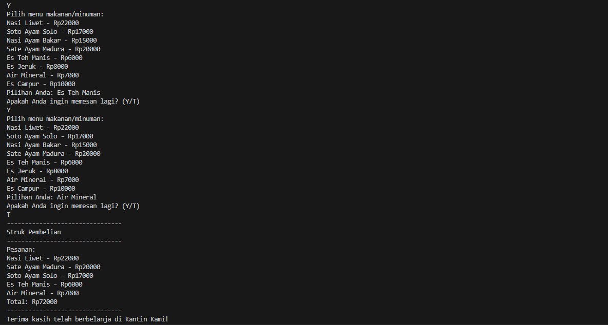

# Project.UAS

| NAMA  :| HANNIFA INDAH RAHAYU |
| --- | --- |
| NIM   :| 312310653 |
| KELAS :| TI.23.A6 |
| DOSEN :| Agung Nugroho,S.Kom.,M.Kom |

# Tugas Project Ujian Akhir Semester

## **Program Kasir Di Sebuah Rumah Makan Saung Nusantara** 

|Link Youtube|  |
| --- | --- |

# Code Program Python

# Hasil Program Python

# $${\color{red}PENJELASAN}$$

# List opsi pilihan makanan/minuman
menu = {
    "Nasi Liwet": 22000,
    "Soto Ayam Solo": 17000,
    "Nasi Ayam Bakar": 15000,
    "Sate Ayam Madura": 20000,
    "Es Teh Manis": 6000,
    "Es Jeruk": 8000,
    "Air Mineral": 7000,
    "Es Campur": 10000,
}

# Variabel untuk menyimpan pilihan makanan
pesanan = []

# Variabel untuk menyimpan total harga
total_harga = 0

# Mulai program
print("Selamat datang di Kantin Kami!")

# Ambil input pilihan makanan
while True:
    print("Pilih menu makanan/minuman:")
    for key, value in menu.items():
        print(f"{key} - Rp{value}")

    pilihan = input("Pilihan Anda: ")

   # Jika pilihan tidak valid, minta input ulang
    if pilihan not in menu:
        print("Pilihan tidak tersedia!")
        continue

  # Tambahkan pilihan ke daftar pesanan
    pesanan.append(pilihan)

 # Tanyakan apakah ingin memesan lagi
    print("Apakah Anda ingin memesan lagi? (Y/T)")
    lanjut = input()

 # Jika tidak ingin memesan lagi, lanjutkan ke proses pembayaran
    if lanjut != "Y":
        break

# Hitung total harga pesanan
for item in pesanan:
    total_harga += menu[item]

# Tampilkan struk pembelian
print("--------------------------------")
print("Struk Pembelian")
print("--------------------------------")
print("Pesanan:")
for item in pesanan:
    print(f"{item} - Rp{menu[item]}")
print(f"Total: Rp{total_harga}")
print("--------------------------------")

# Terima kasih
print("Terima kasih telah berbelanja di Kantin Kami!")

# Jalankan program
if __name__== "__main__":
    main()  
